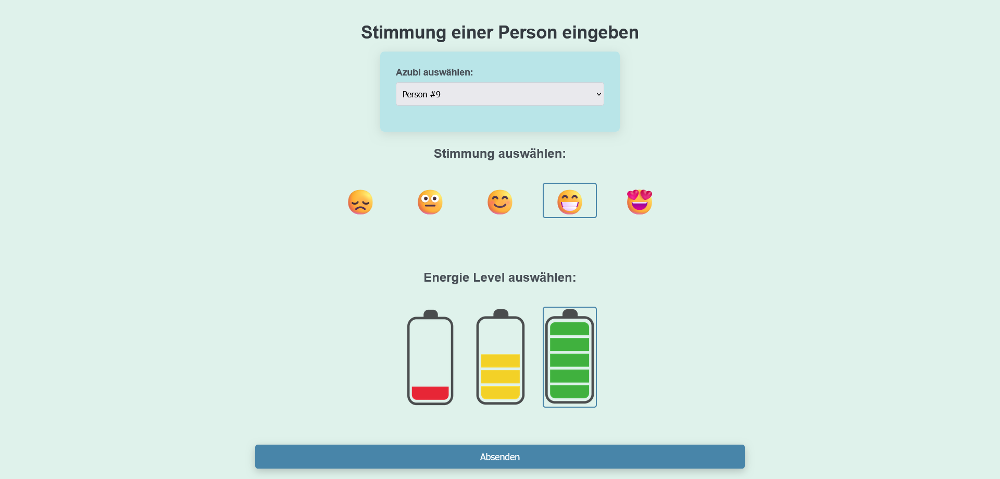

# **Azubi Mood Calendar**

It is a simple Project in PHP + JavaScript-HTML-CSS that was requested of me by my Insturctor for the purpose of tracking the mood and energy levels of the trainees in our class. 
I have included a simple Database for testing purposes in SQL where the daily inputs are kept in a Table called "daily_moods" and the the Trainees Data is kept in a seperate table called "azubis".
I have not included any personal data for obvious reasons.

Here are some screenshots of the Page which should make the Functionality pretty obvious even for not native German speakes.

Any comments or code critiques, as well as improvement tips, are very welcome, as I am a beginner developer trying to learn.
